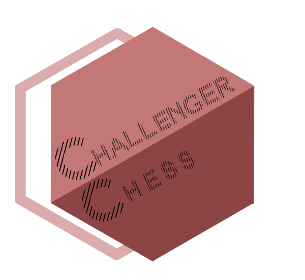

# Challenger



Challenger is my own custom chess engine.

The goal of challenger is to take on the stockfish 10 chess engine, which is currently the best chess engine in the world.

## Progress

Current Level beaten: **None**

Percentage winning next level: **0%**
 
The progress of challenger will be gauged as follows: Challenger will play stockfish at its lowest level. Once the Challenger engine can beat the stockfish engine at the given level at least 50% of the time, the stockfish level will be increased. 
Once Challenger beats stockfish on a given level at least 60% of the time, the "Current Level Beaten" label above will be updated and a release of the code will be made to snapshot the progress made.
The "Percentage winning next level" label indicates challengers progress in beating the next level of stockfish.

Percentages will be determined by playing 10 games and recording winnings.

## TODO
- [x] Implement base UCI compatibility
- [ ] Implement all UCI compatibility
- [x] Create board representation
- [ ] Implement input move handling
- [ ] Implement move generation
- [ ] Search possible moves
- [ ] Evaluate possible moves

## Installation
To install the challenger engine and run it against another chess engine, you will need to install a UCI (Universal Chess Interface) compatible chess program. I recommend Arena, as it is the one I use for challenger.

1) Download and Install [Arena](http://www.playwitharena.com/?Download).
2) Clone and compile challenger. The following should work for most linux systems:
   ```
   git clone https://github.com/folksgl/challenger.git
   cd challenger/
   make
   ```
3) Open Arena and import the challenger engine executable. Navigate to Engines -> Install New Engine and choose the challenger executable that was just compiled. (Will be in the challenger project home directory)

#### Installing Googletest
  If you intend to develop code for Challenger, testing will need to be done with googletest. Installation instructions for googletest can be found in the [googletest readme](https://github.com/google/googletest/blob/master/googletest/README.md). More information about setting up your environment for developing can be found in the [contributing page](https://github.com/folksgl/challenger/blob/master/.github/CONTRIBUTING.md).

## Development
Development for challenger will be done in C++, using the googletest framework for testing.

## Contributing
Before opening issues or pull requests, please read the [contributing page](https://github.com/folksgl/challenger/blob/master/.github/CONTRIBUTING.md) for Challenger.
